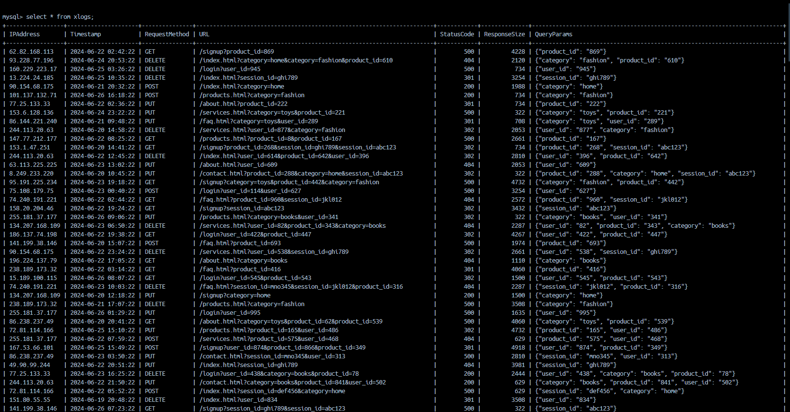
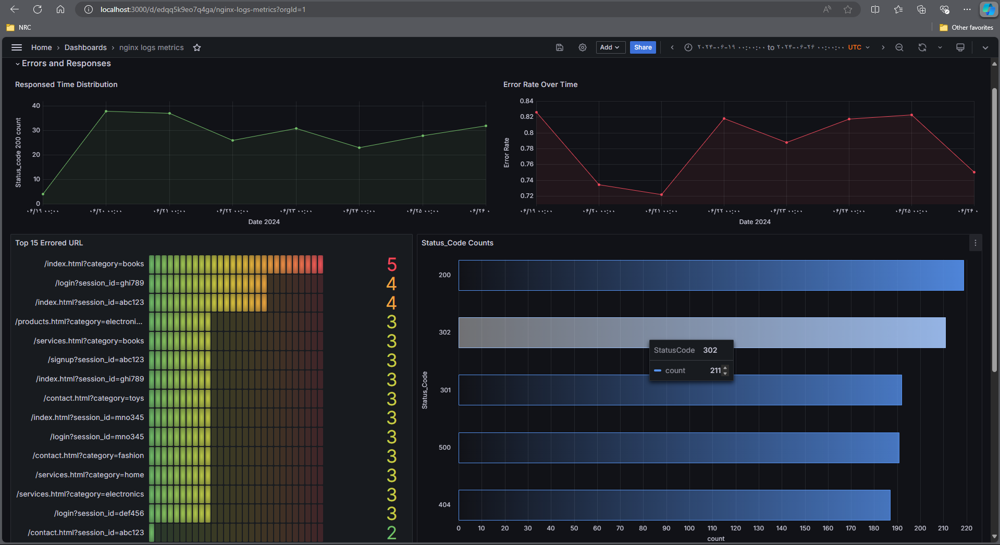
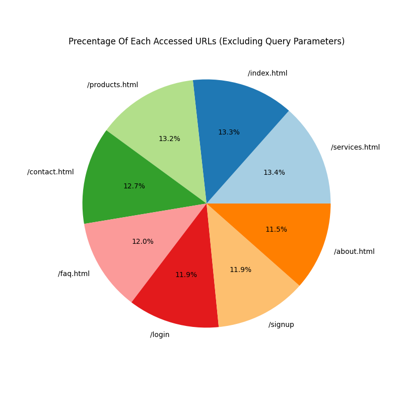

# Digitoon_project
Docker Compose Setup
--------------------

Starting with `Docker-Compose` file, I’ve included services for MySQL, Grafana, and Spark.

MySQL Database and Table
-----------------------

*   I’ve created a MySQL database named `logs` and granted permissions to the new user `digitoon`.
    * `CREATE USER 'digitoon'@'%' IDENTIFIED BY 'digitoon123';
GRANT ALL PRIVILEGES ON logs.* TO 'digitoon'@'%';
FLUSH PRIVILEGES;`
*   The database table and its datatypes :
    * `CREATE TABLE xlogs (
    IPAddress VARCHAR(15),
    Timestamp TIMESTAMP,
    RequestMethod VARCHAR(10),
    URL VARCHAR(255),
    StatusCode INT,
    ResponseSize INT,
    QueryParams TEXT
   );`

####

####
Data Parsing, Cleaning, and Insertion (2 Approach)
-------------------------------------

### Python Approach (`parse_insert.py`)

Python script `parse_insert.py` handles data parsing, cleaning, and insertion. Here are some key points:

*   The `parse_log_line` function extracts fields from the log data using regular expressions.
    *   It’s handling the `QueryParams` as JSON.
    
    *   `Timestamp` formatting and datatype conversion.

*   I didn’t drop the null rows because `IP_Addresses` and `Response_Size` are not the main focus. If I were to drop the row, it would affect the visualization, so I just store them as `NULL`.
    
*   Dropping duplicate rows (`df_cleaned = df.drop_duplicates()`).

*   insert them into the `xlogs` table using `sqlalchemy`.
    

### Spark Approach

`spark_app` directory contains the code :

*   Initialization and configuration.
    
*   A `User-Defined Function` (UDF) for extracting fields, similar to what we discussed earlier.
    
*   Applying necessary transformations.
    
*   Finally, inserting data into `MySQL` using the `JDBC connector`.

*   Submit command :
  
      * `$SPARK_HOME/bin/spark-submit \
  --master spark://spark-master:7077 \
  --executor-memory 512M \
  --total-executor-cores 1 \
  --packages mysql:mysql-connector-java:8.0.26 \
  /opt/bitnami/spark/apps/spark_parse_insert.py`    

Visualization (2 Approach)
-------------
### plotted using `Grafana` and `Matplotlib`.
### Grafana

*   I use `Grafana` because the database is `MySQL`, so I didn’t use Elastic or Loki.

*   creating a dashboard with `MySQL` as the `Data Source`.

*   I have created some visualizations based on certain queries that I believe are useful. These are in accordance with all the columns, which you can view in (`grafana_results/details`).
    
*   `Grafana` allows customization, so I’ve fine-tuned my visualizations based on the queries I’ve written.

####

####

### Matplotlib

*   Using Matplotlib in Python (`pyplot.py`) is another approach. fetch data from `MySQL` using `SQLAlchemy` and execute similar queries.

*   Execute the same queries on data using `Pandas`, and then plot them using `Matplotlib`.
    
*   You can see the results in the (`matplotlib_results`) directory.

####

####
